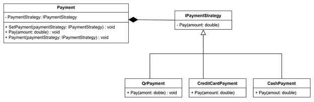

# Patrón Strategy
## Patrón de comportamiento

El patrón Strategy nos permite mantener un conjunto de estrategias/algoritmos de los cuales el objeto cliente puede intercambiarlo dinamicamente según sus necesidades.

> **Nota**: En este patrón hace uso de la composición. (Composición mas que herencia)

## Ejemplo
Imagina que tienes un plataforma E-commerce que soporta multiples formas de pago como son:
* Tarjeta de crédito
* QR
* Efectivo

Donde los clientes pueden escoger el método de pago deseado para pagar sus productos.
Como diseñarías una solución sostenible y mantenible a largo plazo con la posibilidad de añadir mas métodos de pago?

### Solución
Se puede usar el patrón Strategy para proveer a los usuarios la posibilidad de cambiar su método de pago a placer, haciendo la aplicación mantenible a largo plazo.

<p align="center">
    
</p>

### Implementación
La siguiente implementación del patrón Strategy es en C#.
Primero vamos a definir la interfaz común de los métodos de pago que es **IPaymentStrategy**.
> **Tip:** Las interfaces en C# contienen un prefijo "I" como convención.

```cs
public interface IPaymentStrategy
{
    void Pay(double amount);
}
```

Seguimos con la clase **Cliente** que sería **Payment**, el cual se le va a poder modificar el tipo de estrategia para pagar.

```cs
public class Payment
{
    public IPaymentStrategy PaymentStrategy { get; set; }

    public Payment(IPaymentStrategy paymentStrategy)
    {
        PaymentStrategy = paymentStrategy;
    }   

    public void SetPayment(IPaymentStrategy newPaymentStrategy)
    {
        PaymentStrategy = newPaymentStrategy;
    }

    public void Pay(double amount)
    {
        PaymentStrategy.Pay(amount);
    }
}
```

Con la abstracción del método de pago, ahora implementaremos las clases concretas que van a definir el algoritmo a utilizar.

```cs
public class QrPayment : IPaymentStrategy
{
    public void Pay(double amount)
    {
        /*
           Codigo que realiza el pago por QR
         */
    }
}

public class CreditCardPayment : IPaymentStrategy
{
    public void Pay(double amount)
    {
        /*
           Codigo que realiza el pago por tarjeta de credito
         */
    }
}

public class CashPayment : IPaymentStrategy       
{
    public void Pay(double amount)
    {
        /*
           Codigo que realiza el proceso de pago en efectivo
         */
    }
}
```

### Relación entre patrones
* Podemos usar el patrón **Dependency Injection** para eliminar _hardcoding_ de los constructores, junto a diccionarios en contra de las sentencias _if_.
* Se puede aplicar el patrón **Proxy** para revisar las reglas la lógica de negocio antes de escoger la estrategia para pagar.
* El uso de **Adapter** ayudaría a unificar codigo de terceros a nuestro dominio para volverlo una estrategia mas.

### Video del patrón Strategy
<p align="center">
  <a href="https://www.youtube.com/watch?v=VQ8V0ym2JSo&pp=ygUPcGF0cm9uIHN0cmF0ZWd5">
    
  </a>
</p>

## Referencias

Strategy. (s/f). Refactoring.guru. Recuperado el 17 de marzo de 2025, de https://refactoring.guru/es/design-patterns/strategy
<br/>  
BettaTech [@BettaTech]. (s/f). STRATEGY | PATRONES de DISEÑO. Youtube. Recuperado el 17 de marzo de 2025, de https://www.youtube.com/watch?v=VQ8V0ym2JSo  
<br/>
Sánchez, M. Á. (2020, febrero 26). Patrón Estrategia (Strategy Pattern) - All you need is Clean Code - Medium. All You Need Is Clean Code. https://medium.com/all-you-need-is-clean-code/patr%C3%B3n-estrategia-strategy-pattern-654c6e9d2abe
