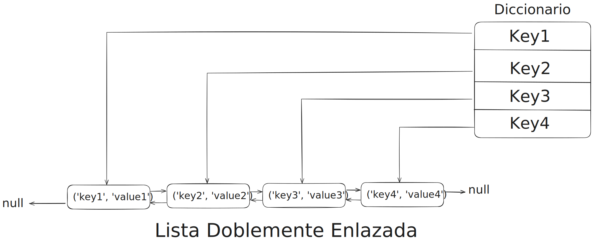

# Problema LRUCache
Tu programa esta corriendo muy lento porque se está accediento a los datos desde el disco una y otra vez. Para mejorar el rendimiento decides construir un simple almacenamiento llave-valor para almacenar en cache estos datos en memoria. Decides construir un sistema de almancenamiento en cache que solo mantiene los N items mas usados recientemente - también conocidos como los recientes LRU de almacenamiento en cache.

Escribe una clase LRUCache(n) que acepta un limite de tamaño N. Este debe dar soporte a el método set(key, value) para insertar o actualizar elementos y un metodo get(key) para obtener elementos. Puedes implementar una solución donde estos dos metodos se ejecuten en un tiempo O(1)?

## Solución
¿Cómo podriamos obtener el valor de una llave de manera constante?
¿Cómo podriamos llevar un registro de las llaves mas usadas recientemente?

Se puede hacer una combinación entre dos estructura de datos que son:
* Lista doblemente enlazada (Double Linked List)
* Diccionario (HashTable, HashMap)

<p align="center">
    
</p>

#### ¿Porqué guardar la llave en el nodo de la lista enlazada?
Al momento de usar el metodo `get(key)` o `put(key, value)` necesitamos registrar en todo momento la nueva _llave menos usada recientemente_.
 
### Pseudocódigo
```
LRUCache(n):
    ListaEnlazada
    Diccionario
    Size

    put(key, value):
        if key in Diccionario: 
            ListaEnlazada.Update(key, value)
            Diccionario.Update(key, value)
        else if Diccionario.size >= Size:
            EliminarMenosReciente(Diccionario, ListaEnlazada)
            ListaEnlazada.Insertar(key, value)
            Diccionario.Insertar(key, value)
        else        
            ListaEnlazada.Insertar(key, value)
            Diccionario.Insertar(key, value)

    get(key):
        if key not in Diccionario:
            return None

        ListaEnlazada.Update(key, value)

        return Diccionario.at(key)
```


### Codificación en C++

> **Importante:** No olvidemos incluir las librerias necesarias y el espacio de nombre.
```cpp
#include <unordered_map>
#include <utility>

using namespace std;
```

Primero creamos la clase Node para la lista enlazada

```cpp
template<class TKey, class TValue>
class Node {

    private:
        Node<TKey, TValue>* next;
        Node<TKey, TValue>* prev;
        pair<TKey, TValue> value;

    public:
        Node(TKey key, TValue value) {
            this->value = make_pair(key, value);
            this->prev = nullptr;
            this->next  = nullptr;
        }


        Node<TKey, TValue>*& getNext() {
            return this->next;
        }

        Node<TKey, TValue>*& getPrev() {
            return this->prev;
        }

        pair<TKey, TValue> getValue() {
            return this->value;
        }

        void setValue(TKey key, TValue value) {
            this->value = make_pair(key, value);
        }
};
```

Tambien creamos la clase LinkedList que es el responsable de manejar correctamente la lista enlazada

```cpp
template<class TKey, class TValue>
class LinkedList {
    private:
        Node<TKey, TValue>* head;
        Node<TKey, TValue>* tail;
        int size;

        void extract_back() {

            Node<TKey, TValue>* temp = this->tail;

            this->tail = this->tail->getPrev();
            this->tail->getNext() = nullptr;
            
        }

        void extract_front() {
            Node<TKey, TValue>* temp = this->head;

            this->head = this->head->getNext();
            this->head->getPrev() = nullptr;
           
        }

    public:
        LinkedList() {
            this->head = nullptr;
            this->tail = nullptr;
            this->size = 0;
        }

        Node<TKey, TValue>* getHead() {
            return this->head;
        }

        Node<TKey, TValue>* getTail() {
            return this->tail;
        }

        Node<TKey, TValue>* getSize() {
            return this->size;
        }

        void prepend(Node<TKey, TValue>*& newNode) {
            
            if(this->head == nullptr) {
                this->head = newNode;
                this->tail = newNode;
            }
            else {
                newNode->getNext() = this->head;
                this->head->getPrev() = newNode;
                this->head = newNode;
            }

            size += 1;
            
        }

        bool empty() {
            return this->size == 0;
        }

        void extract(Node<TKey, TValue>* node) {
            
            if(this->empty()) {
                return;
            }
            else if(this->head == this->tail && this->head == node) {
                this->head = this->tail = nullptr;
            }
            else if(this->head == node) {
                this->extract_front();
            }
            else if(this->tail == node) {
                this->extract_back();
            }
            else {
                node->getPrev()->getNext() = node->getNext();
                node->getNext()->getPrev() = node->getPrev();
            }

            size -= 1;
        }


        void pop_back() {

            if(this->empty()) {
                return;
            }
            
            Node<TKey, TValue>* node = this->tail;
            
            if(this->head == this->tail) {
                this->head = this->tail = nullptr;
            }
            else {
                this->tail = this->tail->getPrev();
                node->getPrev()->getNext() = nullptr;
            }

            delete node;
            size -= 1;
            
        }

};
```
> **Nota** : Las clases de la lista enlazada son plantillas de clase o **class templates** para poder usarla con diferentes tipos de datos


Y para finalizar tenemos la clase que principal que maneja la solución

```cpp
template<class TKey, class TValue>
class LRUCache {
    public:
        LRUCache(int capacity) {
            this->capacity = capacity;
            linkedList = new LinkedList<TKey, TValue>();
        }
        
        TKey get(TKey key) {
            if(dictionary.find(key) == dictionary.end())
                return TKey();

            Node<TKey, TValue>* currentNode = dictionary.at(key);
            linkedList->extract(currentNode);
            linkedList->prepend(currentNode);
            return dictionary.at(key)->getValue().second;
        }
        
        void put(TKey key, TValue value) {
            if(dictionary.find(key) != dictionary.end()) {
                Node<TKey, TValue>* currentNode = dictionary.at(key);
                currentNode->setValue(key, value);

                linkedList->extract(currentNode);
                linkedList->prepend(currentNode);
            }
            else if(dictionary.size() >= capacity) {
                Node<TKey, TValue>* currentNode = linkedList->getTail();
                Node<TKey, TValue>* newNode = new Node<TKey, TValue>(key, value);

                dictionary.erase(currentNode->getValue().first);
                linkedList->pop_back();
                
                dictionary.insert(make_pair(key, newNode));
                linkedList->prepend(newNode);
            }
            else {
                Node<TKey, TKey>* newNode = new Node<TKey, TValue>(key, value);

                dictionary.insert(make_pair(key, newNode));
                linkedList->prepend(newNode);
            }
        }

      
    private:

        int capacity;
        unordered_map<TKey, Node<TKey, TValue>*> dictionary;
        LinkedList<TKey, TValue>* linkedList;
};

```

> **Precaución:** La instancia de la clase _LinkedList_ no se libera directamente en la clase _LRUCache_. Recuerda siempre liberar memoria para evitar fugas de memoria
